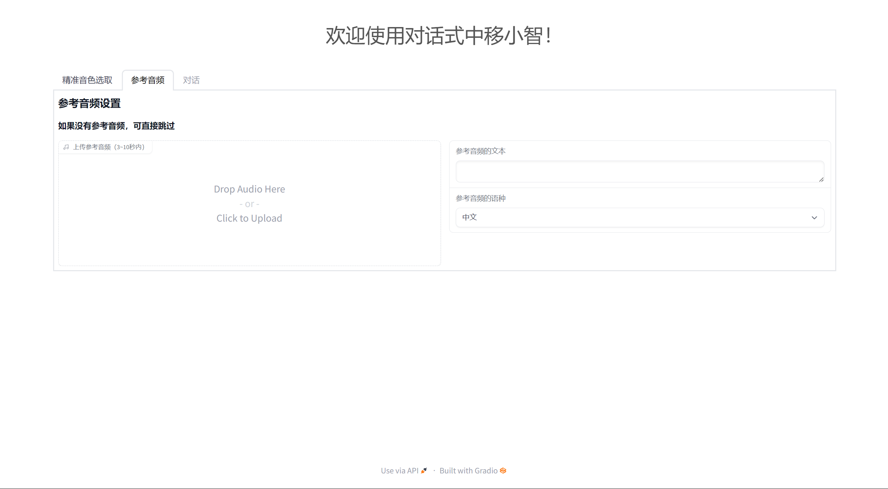

<h1>Chat中移小智</h1>

> 基于GPT-SoVITS的智能语音聊天助手

--
新增无参考音频 直接对话

但推荐用3-10秒的参考音频，效果会好很多

## 功能：

1. **零样本对话** 

3. **跨语言支持** 

4. **WebUI** 

## 安装

### 测试通过的环境

- Python 3.9，PyTorch 2.0.1，CUDA 11
- Python 3.10.13，PyTorch 2.1.2，CUDA 12.3
- Python 3.9，Pytorch 2.2.2，macOS 14.4.1（Apple 芯片）
- Python 3.9，PyTorch 2.2.2，CPU 设备

_注: numba==0.56.4 需要 python<3.11_

[下载整合包](https://pan.baidu.com/s/1zOWbZBLaxSQToLCRC7jHeQ?pwd=m0fl)，双击 `go-webui.bat` 即可启动 GPT-SoVITS-WebUI。

项目模型
---
GPT-SoVITS：https://github.com/RVC-Boss/GPT-SoVITS.git

